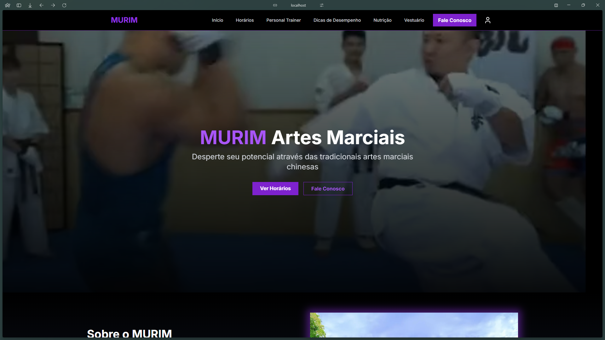

# Murim Artes Marciais


## Descrição
O projeto **Murim Artes Marciais** é uma aplicação web que apresenta uma academia fictícia de artes marciais, com foco nas artes marciais chinesas. Ele inclui:

- **Backend**: Desenvolvido em PHP com o framework Slim e PostgreSQL para armazenar informações sobre alunos, instrutores e aulas.
- **Frontend**: Construído com Next.js, React.js, TypeScript e Tailwind CSS para fornecer uma interface amigável, permitindo visualizar informações da academia, inscrever-se em aulas e acessar conteúdos relacionados.
- **API REST**: Responsável pela comunicação entre o frontend e o banco de dados, implementando operações **CRUD**.
- **Autenticação**: Garante que apenas usuários autorizados possam realizar determinadas ações, como inscrição em aulas ou acesso a conteúdo exclusivo.
- **Responsividade**: Otimizado para uso tanto em dispositivos móveis quanto em desktops.
- **Documentação**: Este `README.md` abrange a configuração, os requisitos do sistema e os recursos disponíveis. As páginas incluem login, cadastro, perfil, contato, agendamento de instrutores e ferramentas administrativas para gerenciamento de alunos, instrutores, horários, produtos e mensagens.

## Desenvolvido por:
- Jorge João Hermes Neto
- Matheus Willian Freire de Souza Jucá

#### Utilizando (Windows):
- [JetBrains WebStorm](https://www.jetbrains.com/pt-br/webstorm/)
- [JetBrains PhpStorm](https://www.jetbrains.com/pt-br/phpstorm/)

## Conteúdo da Pasta
- `backend/`: código do backend (API REST em PHP).
- `frontend/`: código do frontend (Next.js, React.js, TypeScript e Tailwind CSS).
- `README.md`: documentação sobre instalação e execução.
- `2025-03-10-utf-8-backup.tar`: backup do banco PostgreSQL (UTF-8) em tar.

## Requisitos (Windows)
####  Antes de começar, deve-se instalar todos os requisitos para que o projeto funcione corretamente.
- [PHP](https://windows.php.net/download/)
- [Composer](https://getcomposer.org/Composer-Setup.exe)
- [PostgreSQL](https://sbp.enterprisedb.com/getfile.jsp?fileid=1259270)
- [Node.js](https://nodejs.org/dist/v22.14.0/node-v22.14.0-x64.msi)
- [XAMPP](https://sourceforge.net/projects/xampp/files/XAMPP%20Windows/8.2.12/xampp-windows-x64-8.2.12-0-VS16-installer.exe/download)

## Instalação e Execução (Windows)

1. Importe o backup `2025-03-10-utf-8-backup.tar` para o PostgreSQL criando uma database chamada 'murim_artes_marciais'. Além disso, configure a variável `$password` do `backend/config/Database.php` para se adequar ao usuário que você escolheu quando restaurou a database. (É importante que o usuário escolhido tenha acesso a modificar a database criada).

2. Mova o backend para o `htdocs` do XAMPP:
```bash
move backend C:\xampp\htdocs
```
3. Instale as dependências do backend:
```bash
cd C:\xampp\htdocs\backend
composer install
```

4. Abra o XAMPP e inicie o Apache.

5. Instale as dependências do frontend:
```bash
cd frontend
npm install
```

6. Rode o frontend:
```bash
npm run build
npm run start
```

7. Acesse a aplicação em: `http://localhost:3000`.